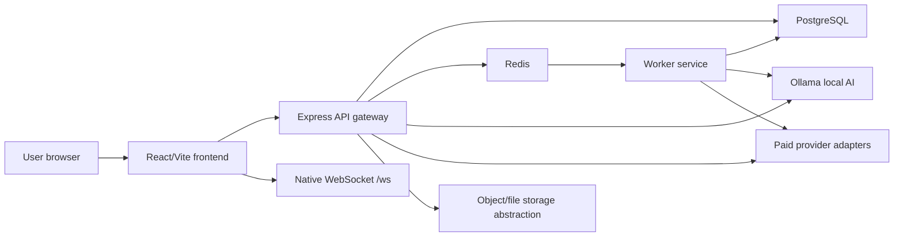

# CODRAI Architecture Status

Last updated: 2026-05-28

## Architecture Summary

CODRAI uses a modular monolith-style backend with service/controller/route separation, a Vite React frontend, Docker Compose runtime, PostgreSQL persistence, Redis/BullMQ queues, Ollama local AI runtime, and native WebSocket realtime subscriptions.

The architecture is stable and should be extended, not replaced.

## Runtime Topology

## Finalized Decisions

| Decision | Status | Reason |
| --- | --- | --- |
| Keep React + Vite frontend | Final | Routes and build are stable |
| Keep Tailwind/global CSS visual system | Final | Theme/readability layer is validated |
| Keep Node/Express backend | Final | Large route surface is already implemented |
| Keep Docker Compose foundation | Final | Local stack is operational |
| Keep PostgreSQL | Final | Primary persistence is already integrated |
| Keep Redis/BullMQ | Final | Queue/worker foundation is operational |
| Keep Ollama local runtime | Final | Local models are active in CPU mode |
| Keep native `/ws` realtime path | Final | Frontend uses it and it validates |
| Keep fixed dashboard sidebar | Final | Validated and requested by user |
| Keep CODRAI logo + CODR robot AI brand | Final | Current brand identity |
| Keep CPU-first policy | Final on current hardware | Intel UHD-only, no CUDA/NVIDIA |

## Frontend Architecture

Primary files:

- `frontend/src/main.jsx`
- `frontend/src/App.jsx`
- `frontend/src/index.css`
- `frontend/tailwind.config.js`
- `frontend/src/pages`
- `frontend/src/features`
- `frontend/src/components`

Status:

- Route shell is stable.
- Protected routes work.
- Error boundary is mounted.
- Dashboard fixed-sidebar shell is stable.
- Global theme/readability layer is active.

Safe modification zones:

- Page-specific UI polish.
- New tests.
- New reusable components that follow existing tokens.
- API client improvements that preserve route contracts.

High-risk zones:

- Route path names.
- `ProtectedRoute` semantics.
- Dashboard shell overflow hierarchy.
- Theme token names used across legacy compatibility selectors.

## Backend Architecture

Primary files:

- `backend/src/app.js`
- `backend/src/bootstrap/runtime-bootstrap.js`
- `backend/src/routes`
- `backend/src/controllers`
- `backend/src/services`
- `backend/src/core`
- `backend/src/workers`
- `backend/src/realtime`
- `backend/src/db`

Status:

- Express middleware stack includes Helmet, CORS, compression, cookies, rate limiting, JSON parsing, optional auth, and request tracing.
- Large API route surface is mounted and operational.
- Auth routes are validated.
- Provider routes are wired.
- Enterprise/deployment/billing/runtime routes are mounted.

Safe modification zones:

- Add validation and smoke tests.
- Extend services behind existing routes.
- Add endpoints only when backward compatible.
- Improve error messages and diagnostics.

High-risk zones:

- Auth middleware.
- Provider key encryption format.
- Database migrations.
- Queue names and worker boot.
- WebSocket message contract.
- Runtime bootstrap service registration.

## Data And Persistence

PostgreSQL:

- Primary application persistence.
- Auth/session/workspace/billing/job/memory-oriented records.
- pgvector-ready memory architecture exists, but RAG completion requires fresh proof.

Redis:

- Queue and realtime runtime support.
- BullMQ worker foundation.

Ollama:

- Local CPU-first inference.
- Current model set: tinyllama, llama3.1, deepseek-coder, qwen2.5-coder.

Object storage:

- API abstraction exists.
- Real S3/R2/MinIO deployment remains pending.

## Realtime Architecture

The frontend uses native WebSocket `/ws` through `frontend/src/features/realtime/realtimeStore.js`.

Status:

- Native subscribe path validated.

Do not replace with Socket.IO unless a formal decision is made. Socket.IO polling exists, but forced websocket-only had a known test issue and is not the active frontend dependency.

## Provider Architecture

Provider orchestration includes:

- Provider registry.
- Provider settings service.
- Encrypted key vault behavior.
- Env fallback.
- Local Ollama provider.
- OpenAI-compatible provider adapters.
- Model router.
- Health and latency scoring.

Status:

- Ollama active.
- Paid providers wired but blocked until keys are configured and validated.

## Deployment Architecture

Existing assets:

- `docker-compose.yml`
- `docker-compose.production.yml`
- `docker-compose.local-ai.yml`
- `deploy`
- `k8s`
- `netlify.toml`
- `vercel.json`
- `render.yaml`
- `railway.json`

Status:

- Local Docker runtime is validated.
- Production deployment configs exist.
- Real domain/TLS/backup/restore/global deployment remains pending.

## Architecture Guardrails

Never do these without explicit approval and a rollback plan:

- Delete Docker volumes.
- Run Docker prune/destructive cleanup.
- Rename public routes.
- Replace backend framework.
- Replace frontend framework.
- Replace PostgreSQL/Redis.
- Replace native WebSocket path.
- Install CUDA/NVIDIA stack on current hardware.
- Pull large models without storage review.
- Rewrite auth/session flow.

Always do these:

- Update the memory docs after major changes.
- Validate affected routes/endpoints.
- Preserve honest blocked states.
- Prefer additive changes over replacements.
