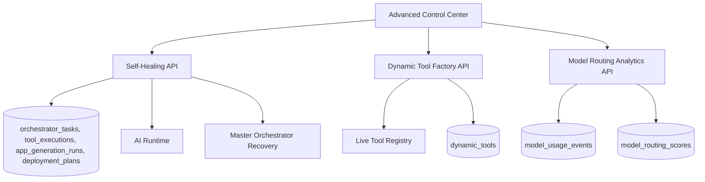
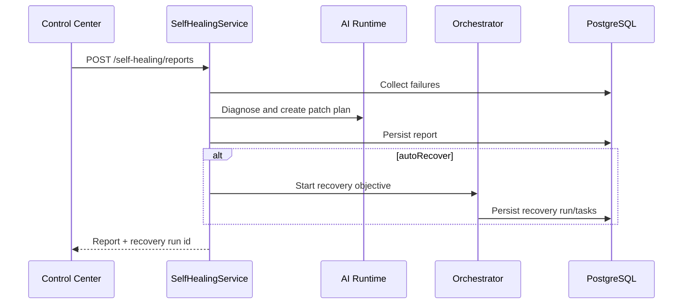

# CODRAI AGI Execution Platform Phase

## Architecture

## New Runtime Systems

- `SelfHealingService`
  - Collects real failure evidence from orchestrator tasks, tool executions, app generation runs, and deployment plans.
  - Uses the live AI runtime to generate structured findings and a safe patch/recovery plan.
  - Can optionally launch a real orchestrator recovery run.
  - Persists reports in `self_healing_reports`.

- `DynamicToolService`
  - Creates database-backed dynamic tools.
  - Registers tools into the live in-memory `ToolRegistry` immediately after creation.
  - Loads active dynamic tools during runtime bootstrap.
  - Supports real API request tools and safe browser extraction wrappers.

- `ModelRoutingAnalyticsService`
  - Calculates provider/model/task scores from real `model_usage_events`.
  - Scores latency, cost, failure rate, and request signal.
  - Persists snapshots in `model_routing_scores`.

## API Documentation

- `GET /api/self-healing/reports`
- `POST /api/self-healing/reports`
  - Body: `{ workspaceId, projectId?, sourceType?, sourceId?, autoRecover? }`

- `GET /api/dynamic-tools`
- `POST /api/dynamic-tools`
  - Body: `{ workspaceId, name, kind, description?, configuration, permissions? }`
  - Supported `kind`: `api_request`, `browser_extract`

- `GET /api/analytics/model-routing?workspaceId=...&refresh=true`
  - `refresh=true` recalculates scores from model usage events.
  - Without refresh, returns latest persisted scores.

## Execution Flow

## Deployment Notes

- Run migrations with `npm run migrate` in `backend/` after `DATABASE_URL` is set.
- Dynamic tools persist in PostgreSQL but register into the active Node process during creation and bootstrap.
- Self-healing recovery is intentionally routed through the orchestrator so existing permissions, retries, memory, and tool policies remain centralized.

## Verification Report

- Backend syntax checks passed for new services and controllers.
- Backend app import passed.
- Runtime bootstrap import passed.
- Frontend production build passed.

## Future Scaling Plan

- Move dynamic tool loading into a distributed registry event so all worker nodes hot-load tools across processes.
- Add signed marketplace package verification before installing third-party tools.
- Connect model routing scores directly into `ModelRouterService` policy weights.
- Add rollback snapshots for generated app files before self-healing recovery changes.
- Add worker-side execution sandboxes for high-risk dynamic tools.
