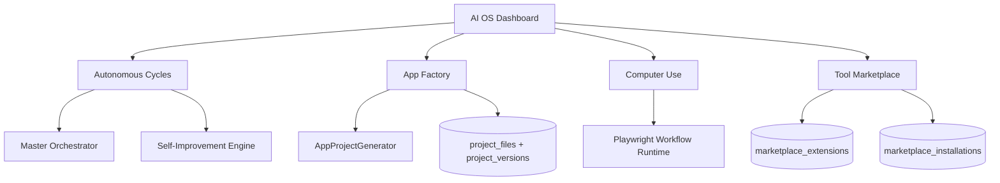

# CODRAI AI Workforce + App Generation Phase

## Runtime Additions

## Backend Systems

- `AutonomousCycleService`
  - Runs a real recursive execute -> snapshot -> self-improve cycle.
  - Persists score, snapshots, orchestrator run ID, and improvement run ID.

- `AppFactoryService`
  - Extends the existing app generator with generation runs, architecture plans, dependency manifests, static debug reports, persisted files, and ZIP export URLs.

- `ComputerUseService`
  - Persists browser sessions and executes Playwright workflows through the existing browser automation foundation.

- `PostgresMarketplaceExtensionRepository`
  - Seeds installable production tool extensions and persists workspace installations.

## New API Surface

- `GET /api/autonomous-cycles`
- `POST /api/autonomous-cycles`
- `GET /api/app-factory/runs`
- `POST /api/app-factory/runs`
- `GET /api/computer-use/sessions`
- `POST /api/computer-use/sessions`
- Existing marketplace endpoints now use PostgreSQL-backed extension/install repositories:
  - `GET /api/marketplace/extensions`
  - `POST /api/marketplace/extensions/install`

## Database Additions

- `autonomous_cycles`
- `app_generation_runs`
- `marketplace_extensions`
- `marketplace_installations`

## Frontend Panels

- `AutonomousCyclePanel`
- `AppFactoryPanel`
- `ComputerUsePanel`
- Updated `AppStorePanel` to fetch and install real marketplace extensions.

## Verification

- Backend app imports passed.
- Runtime bootstrap imports passed.
- Backend module syntax checks passed.
- Frontend production build passed.
