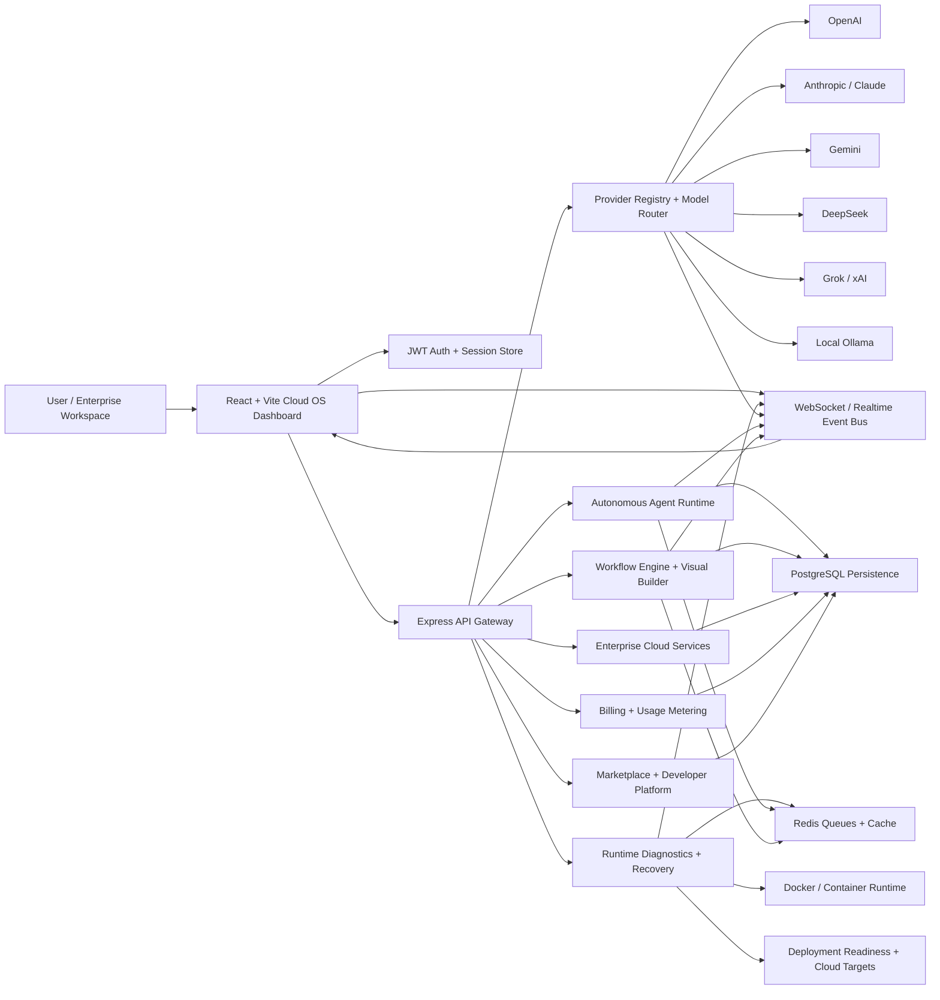

# CODRAI Enterprise AI OS Architecture

## Enterprise Operating System Endpoint

`GET /api/enterprise/cloud/operating-system` aggregates:

- Provider orchestration
- Agent platform
- Workflow/global AI OS services
- Observability
- Security hardening
- Deployment readiness
- Control center telemetry
- Workers
- Queues
- Containers
- Runtime recovery
- Realtime event bus and WebSocket metrics

The endpoint is JWT-protected and returns real degraded/blocked states when infrastructure is unavailable.

