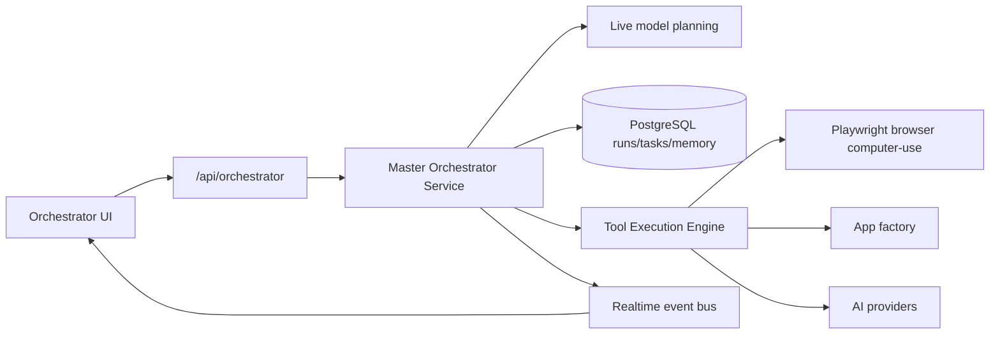

# CODRAI Autonomous Orchestrator Execution Layer

## Runtime Flow

## Backend Modules

- `backend/src/core/orchestrator/orchestrator.service.js`
  - Starts, resumes, cancels, and monitors autonomous runs.
  - Creates dependency-aware task plans through the real AI runtime.
  - Executes permitted tools through the production tool execution engine.
  - Persists execution state, task attempts, results, failures, and memory.
  - Creates recovery tasks for failed steps after retry exhaustion.

- `backend/src/core/orchestrator/agent-catalog.js`
  - Defines planner, researcher, coder, debugging, browser, deployment, memory, analytics, file, and API integration agents.
  - Seeds workspace agent definitions into PostgreSQL before execution.

- `backend/src/core/tools/browser-automation.service.js`
  - Adds real multi-step browser workflows with Playwright navigation, click, fill, wait, extract, screenshot, and navigation memory.

## API Endpoints

- `GET /api/orchestrator/runs?workspaceId=...`
- `POST /api/orchestrator/runs`
- `GET /api/orchestrator/runs/:runId?workspaceId=...`
- `POST /api/orchestrator/runs/:runId/resume`
- `POST /api/orchestrator/runs/:runId/cancel`

## Persistence

Migration `backend/src/db/migrations/001_execution_core.sql` includes:

- `orchestrator_runs`
- `orchestrator_tasks`
- `agent_definitions`
- `memory_edges`
- `browser_sessions`
- `self_improvement_proposals`

Execution memories are written into `ai_memories` with source metadata so later retrieval can inject prior run context.

## Frontend Modules

- `frontend/src/features/orchestrator/orchestratorApi.js`
- `frontend/src/features/orchestrator/components/OrchestratorControlPanel.jsx`

The dashboard provides real start, resume, cancel, refresh, run selection, task graph/status display, task health charting, and live event monitoring through Socket.IO.

## Required Environment

- `DATABASE_URL` for PostgreSQL persistence.
- At least one configured LLM provider key such as `OPENAI_API_KEY`, `ANTHROPIC_API_KEY`, `GEMINI_API_KEY`, or compatible provider key.
- `ENABLE_TERMINAL_TOOL=true` only when shell tool execution is intentionally allowed.
- `ENABLE_FILE_WRITE_TOOL=true` only when filesystem write execution is intentionally allowed.
- Playwright browser binaries available for browser computer-use workflows.

## Verification

- Backend import verification: `node -e "import('./backend/src/app.js').then(()=>console.log('backend imports ok'))"`
- Frontend production build: `npm run build` in `frontend/`
