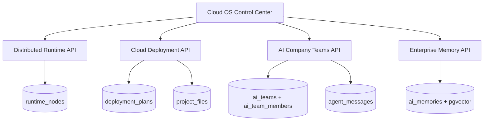

# CODRAI Cloud AI Operating System Phase

## Added Cloud Runtime Systems

## Backend Additions

- `DistributedRuntimeService`
  - Worker heartbeat registration.
  - Node health scoring.
  - Stale runtime detection.
  - Runtime graph API for orchestration maps.

- `CloudDeploymentService`
  - Deployment plans for Vercel, Railway, Render, Netlify, Docker, and VPS-style targets.
  - Generates Dockerfile, CI/CD workflow, and target deployment config into `project_files`.
  - Validates plans through the existing real tool execution layer.

- `EnterpriseMemoryService`
  - Semantic search using pgvector when embeddings/provider are available.
  - Keyword fallback against persisted `ai_memories`.

- `AiTeamService`
  - Persistent autonomous company teams.
  - Role hierarchy and member persistence.
  - Team messaging through `agent_messages`.

## New API Surface

- `GET /api/distributed-runtime/nodes`
- `POST /api/distributed-runtime/nodes/heartbeat`
- `GET /api/distributed-runtime/graph`
- `GET /api/deployment/plans`
- `POST /api/deployment/plans`
- `POST /api/deployment/plans/:planId/execute`
- `GET /api/memory/search`
- `GET /api/teams`
- `POST /api/teams`
- `POST /api/teams/:teamId/messages`

## Database Additions

- `runtime_nodes`
- `deployment_plans`
- `ai_teams`
- `ai_team_members`

## Frontend

- `CloudOsControlCenter`
  - Heartbeats local runtime node.
  - Creates and validates deployment plans.
  - Creates AI company teams and persists team messages.
  - Searches enterprise memory.

## Verification

- Backend service syntax checks passed.
- Backend app import passed.
- Runtime bootstrap import passed.
- Frontend production build passed.
