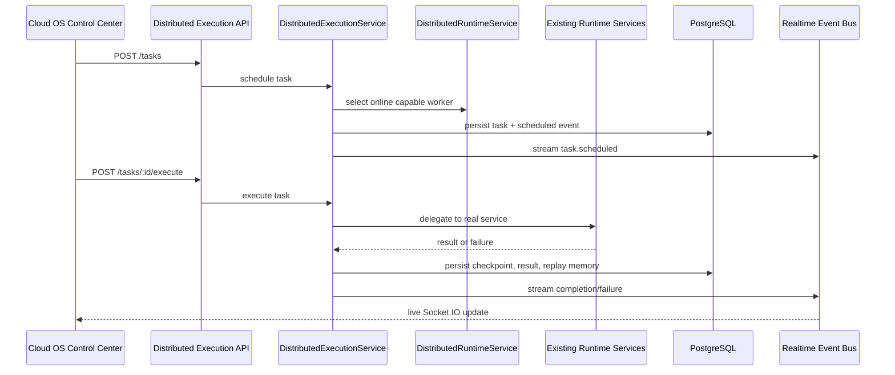

# CODRAI Distributed Autonomous Runtime Platform Phase

This phase extends the existing realtime AGI internet execution cloud without replacing the orchestrator, mission control, telemetry, deployment, or realtime event infrastructure.

## Runtime Layer

`DistributedExecutionService` schedules, assigns, executes, snapshots, replays, recovers, and analyzes distributed execution tasks. It delegates to existing production services:

- `InternetExecutionService` for browser/internet execution clusters
- `MissionControlService` for mission recovery tasks
- `CloudDeploymentService` for deployment health execution
- `ToolExecutionEngine` for real tool invocation
- `RuntimeTelemetryService` for persistent metrics and live streams
- `DistributedRuntimeService` for node health, capability matching, and worker selection

## Persistence Added

- `distributed_execution_tasks`
- `distributed_execution_events`
- `execution_state_snapshots`
- `execution_replay_memories`
- `runtime_scaling_decisions`

These tables persist queue state, execution attempts, task checkpoints, timeline events, replay memory, scaling decisions, resource limits, failure isolation, and audit history.

## API Surface

- `GET /api/distributed-execution/tasks`
- `POST /api/distributed-execution/tasks`
- `GET /api/distributed-execution/tasks/:taskId`
- `POST /api/distributed-execution/tasks/:taskId/execute`
- `POST /api/distributed-execution/tasks/:taskId/command`
- `GET /api/distributed-execution/tasks/:taskId/timeline`
- `GET /api/distributed-execution/tasks/:taskId/replay`
- `POST /api/distributed-execution/recover`
- `GET /api/distributed-execution/analytics`
- `POST /api/distributed-execution/scaling/decision`

Supported task types:

- `internet_execution`
- `mission_recovery`
- `deployment_health_check`
- `tool_execution`
- `telemetry_record`

## Realtime Flow

## Command Center Integration

The Cloud OS dashboard now includes a Distributed Execution Fabric panel with:

- browser-cluster task scheduling
- schedule and run action
- retry, cancel, snapshot, and timeline controls
- stale task recovery
- scaling decision calculation
- persisted analytics summary
- replay memory loading

Every action calls the backend API and persists state in PostgreSQL.

## Production Notes

- Failure isolation marks exhausted tasks as `failed_isolated`.
- Retry recovery persists replay memory and publishes realtime events.
- Scaling decisions are recommendations persisted for audit; they do not provision infrastructure directly.
- Actual worker autoscaling can consume `runtime_scaling_decisions` from deployment automation in a later phase.
