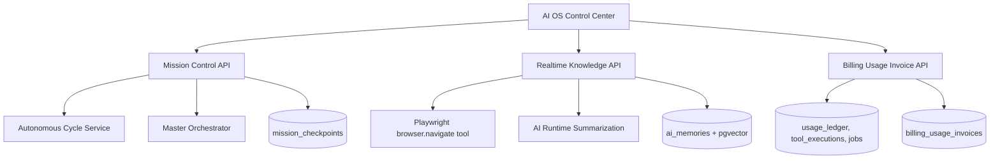

# CODRAI Enterprise AI Civilization Phase

## Runtime Diagram

## Added Systems

- `MissionControlService`
  - Starts long-running autonomous missions.
  - Supports `cycle` mode and direct `orchestrator` mode.
  - Persists mission status, checkpoints, result, and failure state.
  - Emits realtime workspace events.

- `RealtimeKnowledgeService`
  - Ingests live URLs through the real Playwright-backed `browser.navigate` tool.
  - Summarizes page content through the AI runtime.
  - Chunks and stores knowledge into `ai_memories`.
  - Uses embeddings when the OpenAI provider is configured, with safe fallback storage when embeddings are unavailable.

- `BillingAdminService`
  - Generates usage invoices from real `usage_ledger`, `tool_executions`, and `jobs`.
  - Persists draft usage invoices for SaaS monetization workflows.

## API Documentation

- `GET /api/missions?workspaceId=...`
- `POST /api/missions`
  - Body: `{ workspaceId, title, objective, priority?, mode? }`
  - `mode`: `cycle` or `orchestrator`

- `GET /api/knowledge/sources?workspaceId=...`
- `POST /api/knowledge/sources/url`
  - Body: `{ workspaceId, url, projectId? }`

- `GET /api/billing/usage-invoices?workspaceId=...`
- `POST /api/billing/usage-invoices`
  - Body: `{ workspaceId, periodStart?, periodEnd? }`

## Deployment Notes

- Set `DATABASE_URL`, then run `npm run migrate` from `backend/`.
- URL ingestion needs browser automation available through Playwright.
- Semantic embeddings require `OPENAI_API_KEY`; without it, knowledge source records and non-vector memories still persist.
- Billing usage invoices are draft metering records; Stripe subscription checkout remains handled by existing billing routes.

## Security Notes

- Missions and knowledge ingestion route through existing backend auth context and workspace IDs.
- Browser ingestion uses the existing tool execution engine and sandbox policy.
- Invoice generation reads workspace-scoped usage data only.

## Verification Report

- Backend syntax checks passed for mission, knowledge, and billing admin services.
- Backend app import passed.
- Runtime bootstrap import passed.
- Frontend production build passed.

## Scaling Plan

- Move mission execution into Redis/BullMQ jobs for fully detached long-running cloud workers.
- Add per-workspace crawl rate limits and URL allow/deny policies.
- Add invoice finalization and Stripe metered usage item sync.
- Add knowledge graph edge generation from ingested summaries.
- Add mobile push alerts for mission checkpoints and runtime failures.
