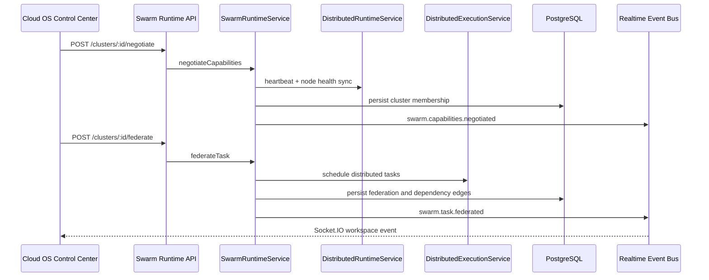

# CODRAI Global Realtime AGI Swarm Execution Phase

This phase extends the existing distributed autonomous runtime platform. It reuses the current distributed execution service, runtime node heartbeats, telemetry, websocket event bus, mission system, deployment system, replay memory, and PostgreSQL migration pipeline.

## Core Service

`SwarmRuntimeService` coordinates global swarm execution on top of the existing runtime:

- swarm cluster creation
- runtime node membership
- dynamic capability negotiation
- agent-to-agent communication
- consensus proposal and voting
- task federation into `DistributedExecutionService`
- workload migration between runtime nodes
- distributed memory replication
- dependency graph persistence
- recovery orchestration
- cluster optimization recommendations
- realtime swarm event persistence and websocket streaming

## Persistence Added

- `swarm_clusters`
- `swarm_cluster_nodes`
- `swarm_agent_messages`
- `swarm_consensus_rounds`
- `swarm_consensus_votes`
- `swarm_task_federations`
- `swarm_memory_replications`
- `swarm_runtime_events`
- `execution_dependency_edges`

## API Surface

- `GET /api/swarm-runtime/clusters`
- `POST /api/swarm-runtime/clusters`
- `GET /api/swarm-runtime/clusters/:clusterId/topology`
- `POST /api/swarm-runtime/clusters/:clusterId/join`
- `POST /api/swarm-runtime/clusters/:clusterId/negotiate`
- `POST /api/swarm-runtime/clusters/:clusterId/messages`
- `POST /api/swarm-runtime/clusters/:clusterId/consensus`
- `POST /api/swarm-runtime/consensus/:consensusId/vote`
- `POST /api/swarm-runtime/clusters/:clusterId/federate`
- `POST /api/swarm-runtime/clusters/:clusterId/migrate`
- `POST /api/swarm-runtime/clusters/:clusterId/replicate-memory`
- `POST /api/swarm-runtime/clusters/:clusterId/recover`
- `POST /api/swarm-runtime/clusters/:clusterId/optimize`
- `GET /api/swarm-runtime/clusters/:clusterId/analytics`
- `GET /api/swarm-runtime/clusters/:clusterId/events`

## Realtime Flow

## Command Center Integration

The Cloud OS Control Center now includes a Global AGI Swarm Mesh panel with real backend actions:

- create/select swarm clusters
- negotiate local runtime node capabilities
- federate browser and telemetry tasks
- open and resolve consensus rounds
- send agent coordination messages
- replicate execution replay memory
- recover swarm state
- request optimization recommendations
- view live topology counts, heatmap metrics, queued tasks, and persisted swarm events

## Verification

This phase was validated with:

- backend syntax checks for new service/controller/routes
- backend app import verification
- runtime bootstrap import verification
- frontend production build

Local migration execution still requires `DATABASE_URL`.
