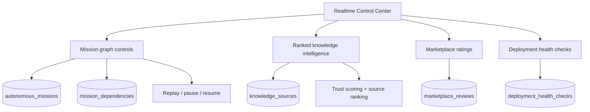

# CODRAI Global AI Civilization Platform Phase

## Added Capabilities

## Mission Execution

- Added parent mission support.
- Added mission dependency graph persistence.
- Added pause, resume, and replay APIs.
- Added mission graph API for control-center visualization.
- Mission resume creates a real orchestrator recovery run from the latest checkpoint.

## Knowledge Intelligence

- URL ingestion now assigns source trust scores.
- Trust signals include HTTPS, institutional domains, substantial content, and title detection.
- Ranked knowledge source API returns trusted sources first.
- Knowledge still persists through `knowledge_sources` and `ai_memories`.

## Marketplace Ecosystem

- Added marketplace reviews and ratings.
- Extension listing now returns aggregate rating and review count.
- App Store UI can install and rate extensions through real backend APIs.

## Deployment Cloud

- Added persistent deployment health checks.
- Health checks execute through the existing real `api.request` tool.
- Deployment UI can validate plans and run health checks.

## New API Surface

- `GET /api/missions/graph`
- `POST /api/missions/:missionId/pause`
- `POST /api/missions/:missionId/resume`
- `POST /api/missions/:missionId/replay`
- `GET /api/knowledge/sources/ranked`
- `POST /api/marketplace/extensions/:extensionId/reviews`
- `POST /api/deployment/plans/:planId/health-check`

## Database Additions

- `mission_dependencies`
- `marketplace_reviews`
- `deployment_health_checks`

## Verification

- Backend syntax checks passed.
- Backend app import passed.
- Runtime bootstrap import passed.
- Frontend production build passed.

## Scaling Plan

- Move mission pause/resume into BullMQ workers for detached cloud mission execution.
- Add graph rendering from `/api/missions/graph` into a canvas or React Flow mission map.
- Add signed marketplace packages and creator payout accounting.
- Add distributed deployment worker health and provider-specific deploy adapters.
- Add knowledge duplicate detection using URL canonicalization and embedding similarity.
