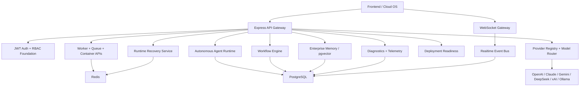

# CODRAI Infrastructure Topology Report

## Live Runtime Ports

- Frontend: `http://localhost:5173`
- Backend: `http://localhost:5000`
- WebSocket: `ws://localhost:5000/ws`
- PostgreSQL: `localhost:5432`
- Redis: `localhost:6379`

## Honest Degradation Rules

The backend reports blocked/degraded states when a dependency is unavailable. It does not fabricate provider readiness, container access, worker registration, or model execution health.

