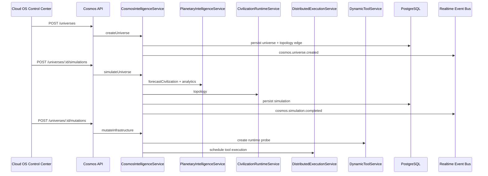

# CODRAI Multi-Planetary AGI Cosmos Operating System Phase

This phase extends the planetary superintelligence network without replacing the civilization, swarm, distributed execution, planetary intelligence, telemetry, or Cloud OS systems.

## Core Service

`CosmosIntelligenceService` adds a multi-planetary orchestration layer:

- cosmos universe creation
- synthetic civilization generation
- predictive universe simulation
- recursive research optimization
- cosmos memory mesh synthesis
- policy evolution through civilization governance
- risk forecasting through planetary simulation
- runtime mutation scheduling through dynamic tools and distributed execution
- AGI-to-AGI diplomacy event persistence
- cosmos observability event streaming

## Persistence Added

- `cosmos_universes`
- `cosmos_synthetic_civilizations`
- `cosmos_simulations`
- `cosmos_research_cycles`
- `cosmos_topology_edges`
- `cosmos_memory_mesh`
- `cosmos_policy_evolutions`
- `cosmos_risk_forecasts`
- `cosmos_runtime_mutations`
- `cosmos_diplomacy_events`
- `cosmos_observability_events`

## API Surface

- `GET /api/cosmos-intelligence/topology`
- `GET /api/cosmos-intelligence/analytics`
- `POST /api/cosmos-intelligence/universes`
- `POST /api/cosmos-intelligence/universes/:universeId/civilizations`
- `POST /api/cosmos-intelligence/universes/:universeId/simulations`
- `POST /api/cosmos-intelligence/universes/:universeId/research`
- `POST /api/cosmos-intelligence/universes/:universeId/memory`
- `POST /api/cosmos-intelligence/universes/:universeId/policies`
- `POST /api/cosmos-intelligence/universes/:universeId/risks`
- `POST /api/cosmos-intelligence/universes/:universeId/mutations`
- `POST /api/cosmos-intelligence/universes/:universeId/diplomacy`

## Runtime Flow

## Cloud OS Integration

The Cloud OS Control Center now includes a Multi-Planetary AGI Cosmos OS panel with real actions:

- create universe
- simulate
- synthetic civilization
- recursive research
- knowledge synthesis
- policy evolution
- risk forecast
- infrastructure mutation
- diplomacy event

## Verification

Validated with:

- backend syntax checks
- backend app import verification
- runtime bootstrap import verification
- frontend production build

Local migration execution requires `DATABASE_URL`.
