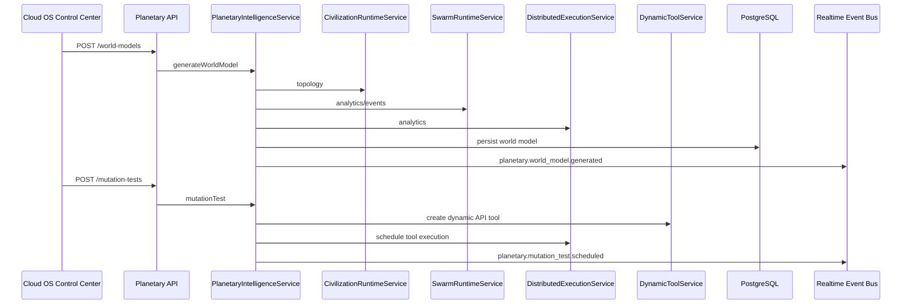

# CODRAI Planetary Superintelligence Network Phase

This phase extends the existing self-evolving AGI civilization operating system. It reuses the civilization runtime, swarm runtime, distributed execution fabric, telemetry/event bus, dynamic tool system, replay memory, and Cloud OS Control Center.

## Core Service

`PlanetaryIntelligenceService` adds planetary-scale coordination and observability:

- autonomous AI research programs
- world-model snapshot generation
- civilization forecasting
- anomaly detection
- adaptive intelligence ranking
- capability market listing
- runtime replication planning
- safe mutation test scheduling
- planetary topology event persistence

## Persistence Added

- `planetary_research_programs`
- `planetary_world_models`
- `planetary_forecasts`
- `planetary_anomalies`
- `planetary_intelligence_rankings`
- `planetary_capability_market`
- `planetary_replication_plans`
- `planetary_topology_events`

## API Surface

- `GET /api/planetary-intelligence/topology`
- `GET /api/planetary-intelligence/analytics`
- `POST /api/planetary-intelligence/research`
- `POST /api/planetary-intelligence/world-models`
- `POST /api/planetary-intelligence/forecasts`
- `POST /api/planetary-intelligence/anomalies/detect`
- `POST /api/planetary-intelligence/rankings`
- `POST /api/planetary-intelligence/capabilities`
- `POST /api/planetary-intelligence/replications`
- `POST /api/planetary-intelligence/mutation-tests`

## Runtime Flow

## Cloud OS Integration

The Cloud OS Control Center now includes a Planetary Superintelligence Network panel with real backend actions:

- research
- world model
- forecast
- anomaly detection
- ranking
- capability market listing
- runtime replication planning
- mutation test scheduling

The panel reads persisted planetary topology and analytics, including world models, open anomalies, latest risk score, and realtime planetary events.

## Verification

Validated with:

- backend syntax checks
- backend app import verification
- runtime bootstrap import verification
- frontend production build

Local migration execution requires `DATABASE_URL`.
