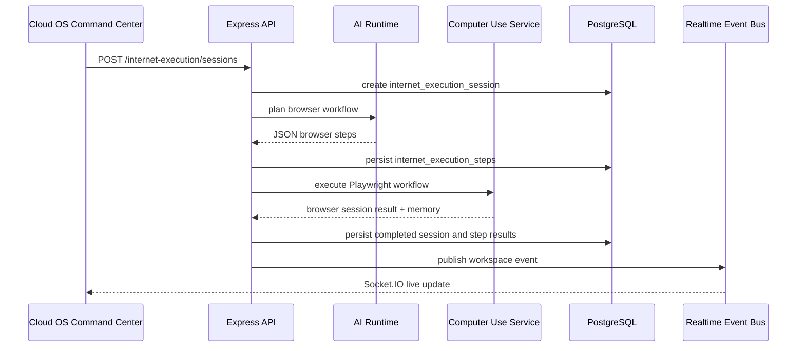

# CODRAI Realtime AGI Internet Execution Cloud Phase

This phase extends the existing CODRAI runtime in place. It does not create a parallel architecture. The new systems reuse the current runtime engine, computer-use browser automation, event bus, PostgreSQL persistence, deployment service, and cloud OS command center.

## Runtime Systems Added

- Persistent internet execution sessions through `InternetExecutionService`
- Realtime runtime telemetry through `RuntimeTelemetryService`
- Deployment snapshots and rollback through `CloudDeploymentService`
- Command-center API wiring for internet execution, telemetry, snapshots, rollback, and live Socket.IO events

## Persistence

The execution core migration now includes:

- `internet_execution_sessions`
- `internet_execution_steps`
- `runtime_telemetry`
- `deployment_snapshots`

Internet execution sessions persist the objective, start URL, generated plan, browser session linkage, result, error, and completion state. Individual steps persist in `internet_execution_steps` for replay and audit.

## API Surface

### Internet Execution

- `GET /api/internet-execution/sessions?workspaceId=...`
- `POST /api/internet-execution/sessions`
- `GET /api/internet-execution/sessions/:sessionId?workspaceId=...`
- `POST /api/internet-execution/sessions/:sessionId/replay`

The start endpoint creates a persisted session, asks the AI runtime for a safe browser workflow plan, executes through the real computer-use service, persists browser-memory results, and emits realtime events.

### Runtime Telemetry

- `GET /api/telemetry?workspaceId=...`
- `GET /api/telemetry/summary?workspaceId=...`
- `POST /api/telemetry`

Telemetry records are persisted in PostgreSQL and emitted over the existing workspace event channel.

### Deployment Snapshots

- `GET /api/deployment/plans/:planId/snapshots?workspaceId=...`
- `POST /api/deployment/plans/:planId/snapshots`
- `POST /api/deployment/plans/:planId/rollback`

Snapshots capture real persisted `project_files`. Rollback restores those files with version increments and emits a deployment rollback event.

## Realtime Flow

## Frontend Integration

`CloudOsControlCenter` now includes:

- Internet Execution Cloud panel
- Runtime Telemetry Stream panel
- live Socket.IO event display
- deployment snapshot and rollback controls

Each action calls backend APIs directly and refreshes persisted state after completion.

## Required Environment

- `DATABASE_URL` for PostgreSQL persistence
- provider keys for AI planning, such as `OPENAI_API_KEY`, `ANTHROPIC_API_KEY`, or another configured provider
- Playwright browser dependencies installed for computer-use execution
- `CLIENT_URL` when running frontend outside `http://localhost:5173`

## Production Notes

- Internet execution does not bypass captchas or protected flows.
- Replay creates a new persisted execution session using the original objective and start URL.
- Deployment rollback restores project files from persisted snapshots; it does not mutate external cloud providers directly.
- Realtime events use the existing event repository and Socket.IO gateway.
