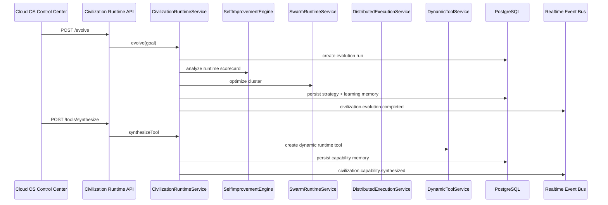

# CODRAI Self-Evolving AGI Civilization Operating System Phase

This phase extends the existing global AGI swarm execution platform. It does not replace the swarm runtime, distributed execution service, telemetry, event bus, deployment infrastructure, self-improvement engine, or Cloud OS Control Center.

## Core Service

`CivilizationRuntimeService` coordinates self-evolution over the existing runtime systems:

- persistent AGI agent identities
- agent learning memories
- long-term cognition graph edges
- recursive strategy planning
- self-improvement runs
- swarm optimization calls
- dynamic tool synthesis
- autonomous mission generation
- governance policy proposal
- execution economy credit ledger
- diagnostics and predictive scaling
- lineage event tracking
- realtime civilization event streaming

## Persistence Added

- `civilization_agent_identities`
- `civilization_learning_memories`
- `civilization_cognition_edges`
- `civilization_strategy_plans`
- `civilization_goals`
- `civilization_governance_policies`
- `civilization_economy_ledger`
- `civilization_lineage_events`
- `civilization_diagnostics`
- `civilization_evolution_runs`

## API Surface

- `GET /api/civilization-runtime/identities`
- `POST /api/civilization-runtime/identities`
- `POST /api/civilization-runtime/memories`
- `GET /api/civilization-runtime/topology`
- `POST /api/civilization-runtime/strategy`
- `POST /api/civilization-runtime/evolve`
- `POST /api/civilization-runtime/tools/synthesize`
- `POST /api/civilization-runtime/missions/generate`
- `POST /api/civilization-runtime/governance/policies`
- `POST /api/civilization-runtime/economy/allocate`
- `GET /api/civilization-runtime/diagnostics`
- `POST /api/civilization-runtime/diagnostics`
- `POST /api/civilization-runtime/scaling/predict`

## Runtime Flow

## Cloud OS Integration

The Cloud OS Control Center now includes a Self-Evolving Civilization OS panel with real backend actions:

- create persistent AGI identity
- record learning memory
- run recursive evolution
- plan strategy
- synthesize dynamic tools
- generate autonomous missions
- propose governance policies
- allocate execution credits
- run diagnostics
- predict scaling

The panel displays identity counts, learning memories, cognition graph edges, evolution runs, diagnostics, and scaling prediction state.

## Verification

Validated with:

- backend syntax checks for service/controller/routes
- backend app import verification
- runtime bootstrap import verification
- frontend production build

Local migration execution requires `DATABASE_URL`.
