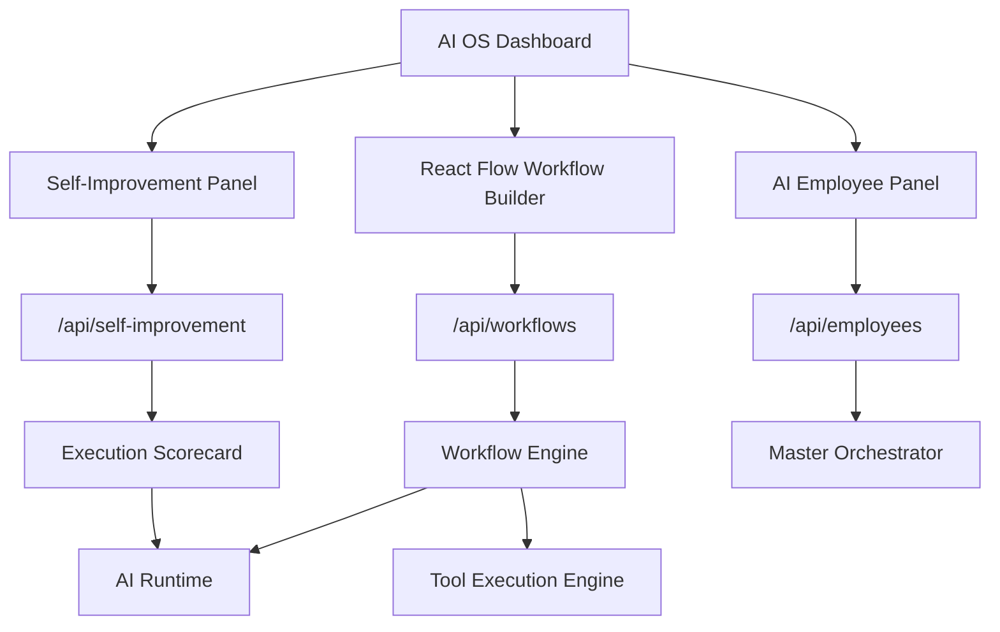

# CODRAI Self-Improving AI OS Phase

## Added Runtime Systems

## Backend

- `SelfImprovementEngine`
  - Scores real orchestrator task history, tool executions, and model usage.
  - Calls the live AI runtime for optimization recommendations.
  - Persists learning runs and improvement proposals.

- `PostgresWorkflowRepository`
  - Persists visual workflow definitions in `saved_workflows`.
  - Persists durable workflow runs in `workflow_runs`.
  - Updates per-step execution state for replay and recovery.

- `WorkflowEngine`
  - Now supports executable tool nodes through `ToolExecutionEngine`.
  - Existing AI and agent nodes continue to execute through runtime systems.

- `AiEmployeeService`
  - Creates persistent AI employees with role, goals, personality, permissions, memory, and execution history.
  - Assignments launch real orchestrator runs.

## New API Surface

- `GET /api/workflows`
- `POST /api/workflows`
- `POST /api/workflows/:workflowId/runs`
- `GET /api/workflows/runs/:runId`
- `POST /api/workflows/runs`
- `GET /api/self-improvement/runs`
- `POST /api/self-improvement/runs`
- `GET /api/self-improvement/proposals`
- `GET /api/employees`
- `POST /api/employees`
- `POST /api/employees/:employeeId/assignments`

## Database Additions

- `self_improvement_runs`
- `workflow_runs`
- `ai_employees`

## Frontend

- `VisualWorkflowBuilder`
  - Uses React Flow.
  - Saves executable workflows to backend persistence.
  - Runs saved workflows through backend workflow execution.

- `SelfImprovementPanel`
  - Triggers real learning analysis.
  - Shows stored learning runs and optimization proposals.

- `AiEmployeePanel`
  - Creates persistent AI employees.
  - Assigns autonomous work through the orchestrator.

## Verification

- Backend app imports passed.
- Runtime bootstrap imports passed.
- Frontend production build passed.
- `@xyflow/react` installed for the workflow builder.
